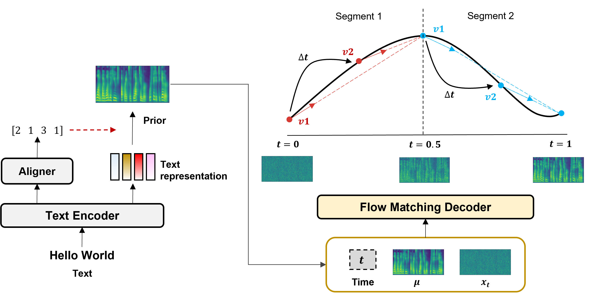

# RapFlow-TTS: Rapid High-Fidelity Text-to-Speech via Improved Consistency Flow Matching

This repository is the **official** implementation of *RapFlow-TTS: Rapid High-Fidelity Text-to-Speech via Improved Consistency Flow Matching*. 

In this repository, we provide steps for running *RapFlow-TTS*. 


🙏 We recommend you visit our [demo site](https://tts-demo.github.io/rap.github.io/). 🙏

*RapFlow-TTS* is an ODE-based TTS that can synthesize high-quality speech with fewer steps using improved consistency flow matching. The overall architecture of *RapFlow-TTS* is as below:

<p align="center">
	
</p>

## Requirements & Installation

Clone this repository

```
git clone https://github.com/naver-ai/RapFlow-TTS.git
cd RapFlow-TTS/
```

Set your virtual environment. You can specify other Python versions.

```
conda create -n rapflow python=3.9
conda activate rapflow

or

python3.9 -m venv venv
source venv/bin/activate
```

To install requirements:

```
# you can specify other latest torch versions (we used torch==1.11.0 with cuda 11.3) 
pip install -r requirements.txt
```

For MAS algorithmm run the code below.

```
cd ./model/monotonic_align; python setup.py build_ext --inplace
```


For pre-trained [HiFi-GAN](https://github.com/jik876/hifi-gan) (LJSpeech and universal vocoder), download, unzip, and  place them ```hifigan/weights/LJSpeech``` or ```hifigan/weights/universal```. 

## Prepare datasets

We use the LJSpeech and VCTK datasets.

- The LJSpeech dataset can be downloaded [here](https://keithito.com/LJ-Speech-Dataset/).

- The VCTK dataset (*trimmed version*) can be downloaded [here](https://datashare.ed.ac.uk/handle/10283/3443).

- We follow the train, valid, and test set split of Grad-TTS for the LJSpeech dataset.

- We use the random set split for the VCTK dataset.


## Preprocess

For **set split and text preprocess**, run the following code with the config option (LJSpeech or VCTK):

```
python ./preprocess/preprocess.py --config ./config/{dataset}/preprocess.yaml

Example:
    python ./preprocess/preprocess.py --config ./config/LJSpeech/preprocess.yaml
    python ./preprocess/preprocess.py --config ./config/VCTK/preprocess.yaml
```

The codes yield the two meta datalist for training.

```
{train, valid, test}.txt :
    Path|Text|Speaker

cleaned_{train, valid, test}.txt :
    Path|Text|Phoneme|Speaker
```

To obtain statistics for mel normalization, run the following code. 

- When you run the below code for the first time, the ```model.data_stats``` should be set as [0,1].

- Modify statistics of ```model.data_stats``` in the model configuration.

- In practice, we use mel normalization only for LJSpeech dataset.

```
python get_mel_stats.py --config ./config/{dataset}/base_stage1.yaml

Example:
    python get_mel_stats.py --config ./config/LJSpeech/base_stage1.yaml

Configurations:
    ├── path
    ├── preprocess
    ├── model
    |     ├── data_stats: [mean, std], [0, 1] --> [new stats]
    ├── train
    ├── test
```

## Training

To train RapFlow-TTS from scratch, run the following code.

- If you want to change training options such as num_worker, cuda device, and so on, check ```argument.py```.

- If you want to edit model or training settings, check ```config/{dataset}/base_stage{1,2,3}.yaml```. 

- The training process contains 3 stages (*Straight flow, Straight flow & Consistency, Straight flow & Consistency & Adversarial learning*). 

```train
Configurations:
    ├── path
    ├── preprocess
    ├── model
    |     ├── encoder
    │     ├── decoder
    │     ├── cfm
    │     ├── gan
    ├── train
    ├── test
```

### Total Stage

For training total stages, please refer to ```train.sh```.
This repository supports multi-gpu training process.

```
######## LJSpeech ##########
# stage 1
CUDA_VISIBLE_DEVICES=0 torchrun --nnodes=1 --nproc_per_node=2 --master_port=29500 train_multi.py --config config/LJSpeech/base_stage1.yaml --num_worker 16 

# stage 2 (improved)
CUDA_VISIBLE_DEVICES=0 torchrun --nnodes=1 --nproc_per_node=2 --master_port=29500 train_multi.py --config config/LJSpeech/base_stage2_ict.yaml --num_worker 16 

# stage 3 (improved)
CUDA_VISIBLE_DEVICES=0 torchrun --nnodes=1 --nproc_per_node=2 --master_port=29500 train_multi_adv.py --config config/LJSpeech/base_stage3_ict.yaml --num_worker 16 


######## VCTK ##########
# stage 1
CUDA_VISIBLE_DEVICES=0,1 torchrun --nnodes=1 --nproc_per_node=2 --master_port=29500 train_multi.py --config config/VCTK/base_stage1.yaml --num_worker 16 

# stage 2 (improved)
CUDA_VISIBLE_DEVICES=0,1 torchrun --nnodes=1 --nproc_per_node=2 --master_port=29500 train_multi.py --config config/VCTK/base_stage2_ict.yaml --num_worker 16 

# stage 3 (improved)
CUDA_VISIBLE_DEVICES=0,1 torchrun --nnodes=1 --nproc_per_node=2 --master_port=29500 train_multi_adv.py --config config/VCTK/base_stage3_ict.yaml --num_worker 16 
```

### Stage 1 

For stage 1, run the code below:
```
CUDA_VISIBLE_DEVICES=0,1 torchrun --nnodes=1 --nproc_per_node=2 --master_port=29500 train_multi.py --config config/{dataset}/base_stage1.yaml --num_worker 16

Configurations:
    ├── path
    ├── preprocess
    ├── model
    |     ├── boundary: 0.0
    ├── train
    ├── test
```

### Stage 2

For stage 2, run the code below. 

- You should check the configuration if the ```stage``` is set to 2. 

- The ```prev_stage_ckpt``` should be set to the path of stage 1 training. 

- It enables weight initialization using stage 1 weights.

```
CUDA_VISIBLE_DEVICES=0,1 torchrun --nnodes=1 --nproc_per_node=2 --master_port=29500 train_multi.py --config config/{dataset}/base_stage2_ict.yaml --num_worker 16

Configurations:
    ├── path
    ├── preprocess
    ├── model
    |     ├── boundary: 0.9 # consistency training on (you can also use 1.0)
    ├── train
    |     ├── stage: 2
    |     ├── prev_stage_ckpt: {path for stage1}
    ├── test
```

### Stage 3

For stage 3, run the code below. 

- You should check the configuration if the ```stage``` is set to 3. 

- The ```prev_stage_ckpt``` should be set to the path of stage 2 training. 

- It enables weight initialization using stage 2 weights.

```
CUDA_VISIBLE_DEVICES=0,1 torchrun --nnodes=1 --nproc_per_node=2 --master_port=29500 train_multi_adv.py --config config/{dataset}/base_stage3_ict.yaml --num_worker 16

Configurations:
    ├── path
    ├── preprocess
    ├── model
    |     ├── boundary: 0.9 # consistency training on (you can also use 1.0)
    ├── train
    |     ├── stage: 3
    |     ├── prev_stage_ckpt: {path for stage2}
    ├── test
```

For stage 3, we set additional 150 and 50 epochs for LJSpeech and VCTK datasets. Considering the fluctuation of discriminator loss, epochs are empirically decided. Using models after loss fluctuation increased may result in a poor synthesis quality, thus loss should be monitored when selecting adversarial learning checkpoints.


<p align="center">   </p> <p align="center"> <strong>Figure: Discriminator Loss Comparison (LJSpeech and VCTK Datasets)</strong> </p>


<!-- <p align="center">
	
</p>

<p align="center">
	
</p> -->

※ We used 1400 (or vctk-1000) epochs for each Stage 1 and Stage 2, but 700(or vctk-500) epochs are enough. In Stage 3, checking the loss graph was the most accurate way to judge performance.

## Evaluation

You can synthesize test files and check Word Error Rate of the synthesized samples by running the code.

The models and configurations will be loaded based on ```weight_path``` option.


```
python test.py --weight_path {weight_path} --model_name {Output folder name} --n_timesteps {NFE} --weight_name {weight name}

Example:
    python test.py --weight_path ./checkpoints/RapFlow-TTS-LJS-Stage3-Improved --model_name RapFlow-TTS --n_timesteps 2 --weight_name model-last
```


## Synthesize

If you want to synthesize samples, run the following codes with pre-trained models. ```spk_id``` option is only for multi-speaker models and 0 is default for a single speaker model.

```
python synthesize.py --input_text "" --weight_path {weight path} --weight_name {weight name} --spk_id {spk id} --n_timesteps {NFE}

Example:
    python synthesize.py --input_text "This is a test sentence" --weight_path ./checkpoints/RapFlow-TTS-LJS-Stage3-Improved --model_name RapFlow-TTS --n_timesteps 2 --weight_name model-last
```

## Pre-trained Models


## Citation

```
```

## License

```
RapFlow-TTS
Copyright (c) 2025-present NAVER Cloud Corp.

Licensed under the Apache License, Version 2.0 (the "License");
you may not use this file except in compliance with the License.
You may obtain a copy of the License at

    http://www.apache.org/licenses/LICENSE-2.0

Unless required by applicable law or agreed to in writing, software
distributed under the License is distributed on an "AS IS" BASIS,
WITHOUT WARRANTIES OR CONDITIONS OF ANY KIND, either express or implied.
See the License for the specific language governing permissions and
limitations under the License.
```


## References

Thanks for the open sources which we referred to as follows.

- [Consistency Flow Matching](https://github.com/YangLing0818/consistency_flow_matching): The consistency flow matching loss for TTS starts from this reposistory.
- [Matcha-TTS](https://github.com/shivammehta25/Matcha-TTS/tree/main): We used network, dataset, and text normalization codes.
- [Grad-TTS](https://github.com/huawei-noah/Speech-Backbones/tree/main/Grad-TTS): We used the monotonic alignment search source code, CMUdict, and filelists for train, valid, and test split.
- [StyleTTS](https://github.com/shivammehta25/Matcha-TTS/tree/main): We used discriminator codes, and modified adversarial learning loss from this repository.
- [DEX-TTS](https://github.com/winddori2002/DEX-TTS): The evaluation and preprocess codes start from this repository. 
- [HiFi-GAN](https://github.com/jik876/hifi-gan), [BigVGAN](https://github.com/NVIDIA/BigVGAN): We used the pre-trained vocoder and implementations for converting waveforms from mel-spectrogram. 
